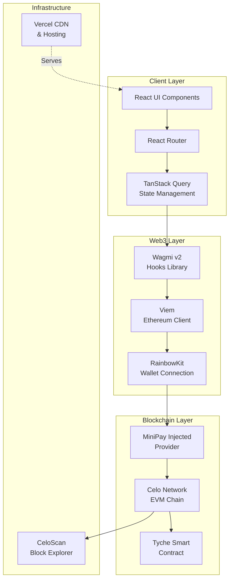
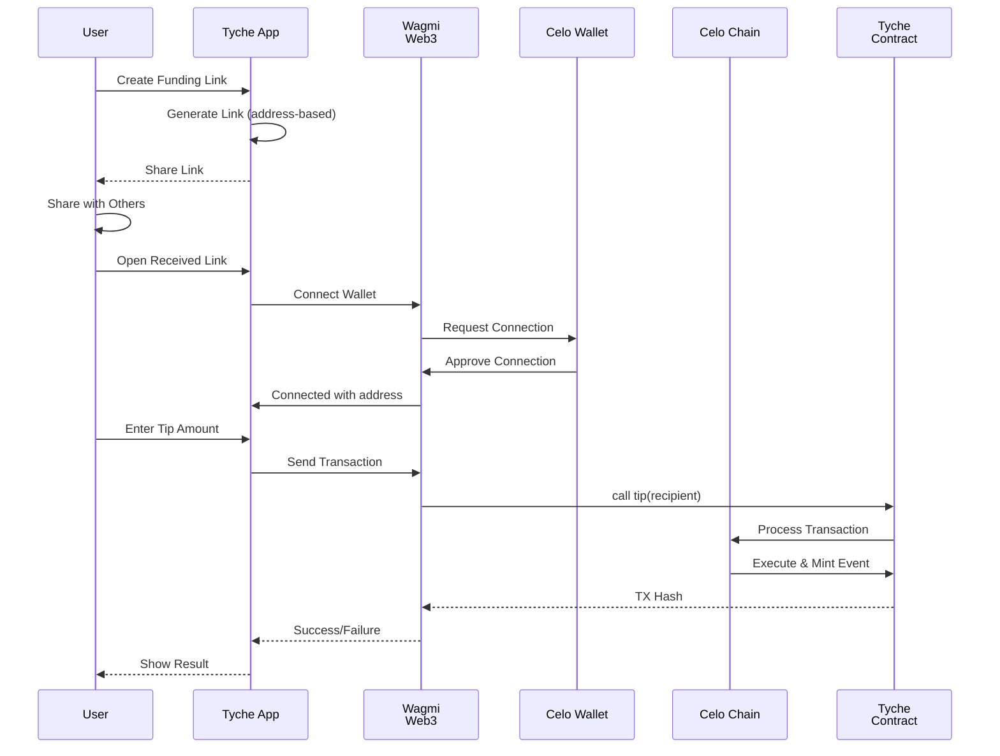
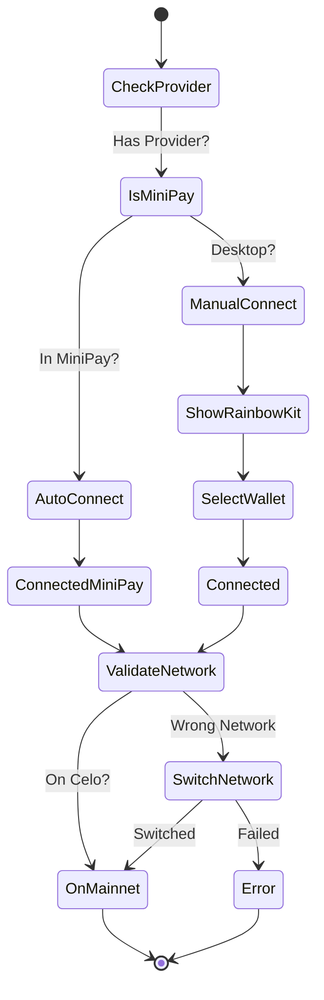

# Tyche 💰

<div align="center">

[](https://www.typescriptlang.org/)
[](https://react.dev/)
[](https://vitejs.dev/)
[](https://celo.org/)
[](LICENSE)
[](#)

**The Premier Web3 Funding Platform on Celo**

Create decentralized funding links and send onchain tips in seconds. No sign-ups, zero platform fees, instant global settlements.

[Live Demo](#) • [Documentation](#documentation) • [Contributing](#contributing)

</div>

---

## 📋 Table of Contents

- [Overview](#overview)
- [Key Features](#key-features)
- [Technology Stack](#technology-stack)
- [Architecture](#architecture)
- [Quick Start](#quick-start)
- [Project Structure](#project-structure)
- [Core Functionality](#core-functionality)
- [MiniPay Integration](#minipay-integration)
- [Development Guide](#development-guide)
- [Testing](#testing)
- [Deployment](#deployment)
- [Contributing](#contributing)
- [License](#license)

---

## 📱 Overview

Tyche is a non-custodial, decentralized funding platform built on the **Celo blockchain**. It enables users to:

- **Create shareable funding links** tied to their Celo wallet
- **Receive instant CELO tips** from anyone, anywhere
- **Leverage MiniPay integration** for seamless mobile wallet experience
- **Maintain full custody** of funds with zero platform fees

The platform is optimized for mobile-first Web3 adoption, particularly in emerging markets where Celo excels.

---

## ✨ Key Features

| Feature | Description | Benefits |
|---------|-------------|----------|
| **⚡ Lightning Fast** | Transactions settle in seconds on Celo | Immediate liquidity and settlement |
| **🔒 Non-Custodial** | Your keys, your crypto | Complete security and control |
| **🌍 Global Reach** | Accessible from anywhere in the world | Borderless payments and tips |
| **📱 MiniPay Native** | Optimized for Celo's mobile wallet | Seamless UX for mobile users |
| **🔗 Shareable Links** | Generate personal funding URLs | Easy sharing across platforms |
| **💎 Zero Fees** | No platform fees or intermediaries | Full value to creators |
| **🎨 Modern UI** | React + Tailwind with shadcn components | Professional, responsive design |

---

## 🛠️ Technology Stack

### Frontend Framework
- **React 18** - UI library
- **Vite** - Next-generation build tool
- **TypeScript** - Type-safe development

### Web3 Integration
- **Wagmi v2** - React hooks for Ethereum/EVM chains
- **Viem** - TypeScript interface for Ethereum
- **RainbowKit** - Wallet connection library
- **Celo** - Layer 1 blockchain network

### UI & Styling
- **Tailwind CSS** - Utility-first CSS framework
- **shadcn/ui** - High-quality React components
- **Lucide Icons** - Beautiful icon set

### State Management & Data
- **TanStack React Query** - Server state management
- **React Router** - Client-side routing
- **Sonner** - Toast notifications

### Testing & Quality
- **Vitest** - Unit testing framework
- **ESLint** - Code linting
- **PostCSS** - CSS transformations

### Deployment
- **Vercel** - Serverless platform (production)
- **Docker** - Containerization support

---

## 🏗️ Architecture

### System Architecture Diagram



### Data Flow Diagram



---

## 🚀 Quick Start

### Prerequisites

- **Node.js** 18+ and **pnpm** 8+
- A **Celo wallet** (MetaMask, MiniPay, or compatible)
- **Git** for version control

### Installation

1. **Clone the repository**
   ```bash
   git clone https://github.com/kramu39/tyche-fund.git
   cd tyche-fund
   ```

2. **Install dependencies**
   ```bash
   pnpm install
   ```

3. **Configure environment** (if needed)
   ```bash
   # Copy example env if available
   cp .env.example .env.local
   ```

4. **Start development server**
   ```bash
   pnpm dev
   ```
   App will be available at `http://localhost:5173`

5. **Build for production**
   ```bash
   pnpm build
   ```

### Verification

Test the core functionality:
- ✅ Navigate to `http://localhost:5173`
- ✅ Connect your wallet
- ✅ Create a funding link
- ✅ Share and test receiving tips

---

## 📂 Project Structure

```
tyche-fund/
├── src/
│   ├── components/           # Reusable React components
│   │   ├── Navbar.tsx       # Navigation component
│   │   ├── Footer.tsx       # Footer component
│   │   ├── CreateLinkCard.tsx    # Link generation UI
│   │   ├── SendTipCard.tsx       # Tip sending form
│   │   ├── TransactionStatus.tsx # TX status display
│   │   └── ui/              # shadcn/ui components
│   │
│   ├── pages/               # Route page components
│   │   ├── Home.tsx         # Landing page
│   │   ├── Dashboard.tsx    # User dashboard
│   │   ├── Fund.tsx         # Funding/tip page
│   │   ├── Index.tsx        # Route index
│   │   └── NotFound.tsx     # 404 page
│   │
│   ├── hooks/               # Custom React hooks
│   │   ├── useTip.ts        # Tip transaction hook
│   │   ├── use-toast.ts     # Toast notifications
│   │   └── use-mobile.tsx   # Mobile detection
│   │
│   ├── lib/                 # Utility functions & config
│   │   ├── contract.ts      # Contract ABI & address
│   │   ├── wagmi.ts         # Wagmi configuration
│   │   ├── helpers.ts       # Helper functions
│   │   └── utils.ts         # Utility functions
│   │
│   ├── App.tsx              # Root component
│   ├── main.tsx             # Entry point
│   ├── vite-env.d.ts        # Vite type definitions
│   ├── App.css              # Global styles
│   └── index.css            # Base styles
│
├── public/                  # Static assets
├── Tests/                   # Test files
├── vite.config.ts          # Vite configuration
├── tailwind.config.ts      # Tailwind configuration
├── tsconfig.json           # TypeScript configuration
├── package.json            # Dependencies & scripts
└── README.md               # This file
```

---

## 🔧 Core Functionality

### 1. Wallet Connection

- **Auto-connect** in MiniPay environments via injected provider
- **Manual connection** via RainbowKit for desktop wallets
- **Network validation** ensures Celo Mainnet usage
- **Connection state** managed globally via Wagmi

### 2. Create Funding Link

**Flow:**
1. Generate unique URL based on user's wallet address
2. Share URL across social media, messaging, websites
3. Link format: `tyche.app/fund?address=0x...`

**Code Reference:**
- Component: `CreateLinkCard.tsx`
- Hook: Custom routing logic in `App.tsx`

### 3. Receive Tips

**Flow:**
1. Recipient shares funding link
2. Visitor opens link → identifies recipient address
3. Sender inputs tip amount
4. Wagmi facilitates wallet interaction
5. Smart contract executes transfer
6. Transaction confirmed on-chain

**Code Reference:**
- Component: `SendTipCard.tsx`
- Hook: `useTip.ts` - manages tip transactions

### 4. Transaction Status

- **Pending**: Transaction submitted to network
- **Confirming**: Waiting for blockchain confirmation
- **Success**: Transaction finalized → link to CeloScan
- **Failed**: Error state → recovery options & add-cash deeplink

**Component:** `TransactionStatus.tsx`

---

## 📱 MiniPay Integration

### Features

| Feature | Implementation | Benefits |
|---------|-----------------|----------|
| **Auto-Connect** | Injected provider detection | Seamless UX |
| **Mainnet Default** | Chain validation enforced | User safety |
| **Add-Cash Deeplink** | Recovery & funding paths | User retention |
| **Hidden Connect** | Implicit via injection | Cleaner UI |
| **Developer Mode** | Testnet support | Easy testing |

### How It Works



### Testing in MiniPay

1. **Start local development**
   ```bash
   pnpm dev
   ```

2. **Expose via ngrok**
   ```bash
   ngrok http 8080
   ```

3. **Load in MiniPay**
   - Open Settings → Developer Settings
   - Enable Developer Mode
   - Enable Use Testnet (optional)
   - Load Test Page → paste ngrok URL

4. **Validate flows**
   - ✅ Auto-connect works
   - ✅ Create link successful
   - ✅ Open `/fund` link and send tip
   - ✅ Success state shows CeloScan link
   - ✅ Failure shows recovery options

---

## 💻 Development Guide

### Local Development

```bash
# Start dev server with hot reload
pnpm dev

# Run linting
pnpm lint

# Preview production build
pnpm build && pnpm preview
```

### Code Quality

| Tool | Command | Purpose |
|------|---------|---------|
| **ESLint** | `pnpm lint` | Code style & errors |
| **Vitest** | `pnpm test` | Unit tests |
| **TypeScript** | Built-in | Type checking |
| **Tailwind** | Built-in | CSS optimization |

### Key Conventions

- **Component naming**: PascalCase (e.g., `CreateLinkCard.tsx`)
- **Hooks naming**: camelCase with `use` prefix (e.g., `useTip.ts`)
- **File organization**: Feature-based structure
- **Styling**: Tailwind utility classes + shadcn components
- **Web3**: Wagmi hooks for contract interactions

### Environment Setup

**Required environment variables** (if applicable):
```bash
VITE_TYCHE_CONTRACT_ADDRESS=0x...
VITE_RPC_URL=https://forno.celo.org
```

---

## 🧪 Testing

### Run Tests

```bash
# Run all tests once
pnpm test

# Run tests in watch mode
pnpm test:watch
```

### Test Coverage

- Utility functions
- Hook logic
- Component rendering
- Web3 interactions

### Manual Testing Checklist

- [ ] Wallet connects successfully
- [ ] Funding link generates correctly
- [ ] Link is copyable and shareable
- [ ] Tip amount validation works
- [ ] Transaction confirmation displays
- [ ] CeloScan link navigates correctly
- [ ] Error recovery paths work
- [ ] Responsive on mobile & desktop

---

## 🚢 Deployment

### Production Deployment (Vercel)

The app automatically deploys on every push to `main`:

```bash
# Build for production
pnpm build

# Output in dist/
# Vercel automatically picks this up
```

**Vercel Configuration:** See `vercel.json`

### Pre-Deployment Checklist

- [ ] Wallet connects through MiniPay injected provider
- [ ] App behaves correctly on Celo Mainnet
- [ ] Metadata (title/description/OG) identifies Tyche clearly
- [ ] No template placeholders remain
- [ ] All links point to production endpoints
- [ ] Error pages work as expected
- [ ] Performance optimized (bundle size checked)

### Monitoring

- Check **Vercel Analytics** for performance metrics
- Monitor **CeloScan** for contract interactions
- Set up **error logging** for production issues

---

## 🤝 Contributing

We welcome contributions! Here's how to get involved:

### Development Process

1. Fork the repository
2. Create a feature branch: `git checkout -b feature/amazing-feature`
3. Commit changes: `git commit -m 'Add amazing feature'`
4. Push to branch: `git push origin feature/amazing-feature`
5. Open a Pull Request

### Code Style

- Use TypeScript for type safety
- Follow ESLint rules (run `pnpm lint`)
- Format code consistently
- Write meaningful commit messages
- Add tests for new functionality

### Reporting Issues

- Use GitHub Issues for bug reports
- Include steps to reproduce
- Provide environment details
- Share error messages/logs

---

## 📄 License

This project is licensed under the **MIT License** - see the [LICENSE](LICENSE) file for details.

---

## 🔗 Resources

- **Celo Docs**: https://docs.celo.org
- **Wagmi Docs**: https://wagmi.sh
- **React Router**: https://reactrouter.com
- **Tailwind CSS**: https://tailwindcss.com
- **shadcn/ui**: https://ui.shadcn.com

---

## 📞 Support

For questions or issues:
- Open an [issue on GitHub](https://github.com/kramu39/tyche-fund/issues)
- Check existing documentation
- Review code comments

---

<div align="center">

**Built with ❤️ for the Celo community**

[⬆ Back to top](#tyche-)

</div>
